# RF Amplifier for IoT Applications (Sub 1.6 GHz)

## Overview
A high-performance RF amplifier designed specifically for IoT devices operating in the ISM band. This project demonstrates the development of a compact, efficient amplifier that achieves significant transmission range improvements while maintaining regulatory compliance. Through careful design and implementation, the amplifier delivers a 9.5dB gain, effectively tripling the operational range from 10m to 31m in typical deployments.

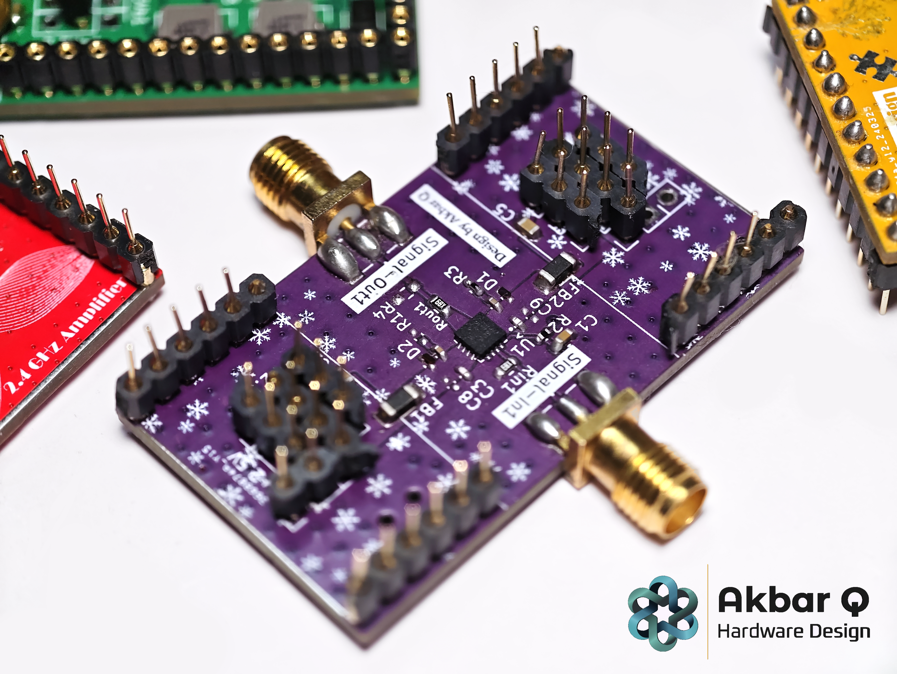
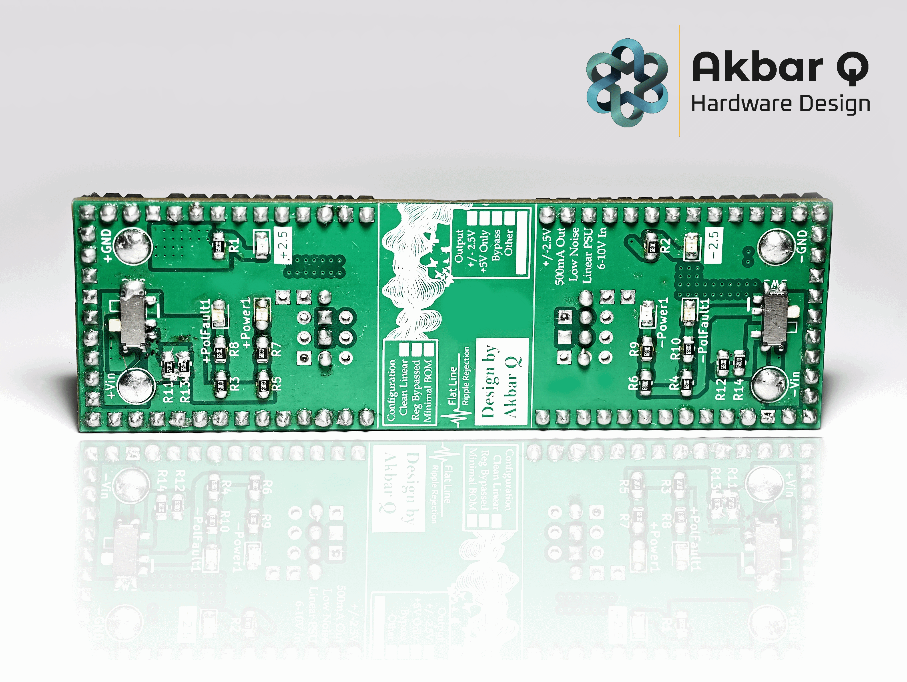
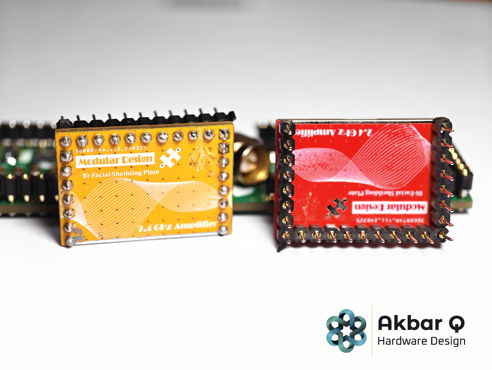

## Technical Details
The amplifier operates in the sub-1.6 GHz frequency range, achieving a maximum gain of 8.14dB at target frequencies with a -3dB bandwidth extending from DC to 1.65 GHz. Input and output matching exceeds -10dB in the critical 800-900 MHz band, ensuring efficient power transfer. The design utilizes a dual rail power supply system and accommodates hand-solderable components (minimum 0603 size) for practical prototyping and assembly, though the amplifier needs a stencil, can't be free hand soldered.

## Design Architecture
The system employs a split architecture, separating power management from RF sections to minimize interference. Power management incorporates multi-order filtering for noise reduction, while the RF section features carefully controlled 50Ω impedance traces. Thermal management was a key consideration, implemented through extensive copper planes and strategic component placement. The design includes TVS protection on power rails and comprehensive EMI shielding through a ground cage implementation.

## Schematics

## Development Process
The project began with an extensive component search focused on the ISM band requirements. The TI THS4302 emerged as the optimal choice, offering 12 GHz GBP and operation at 2.4 GHz partial power or 800 MHz full power. This IC provides built-in feedback networks and power-down capability, significantly simplifying the overall design.

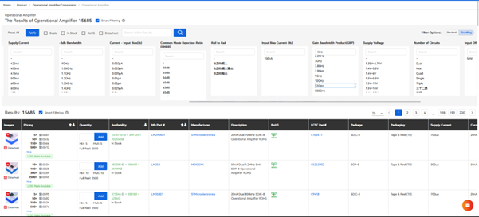

### Component Comparison

| Parameter | THS4302 (Texas Instruments) | ONET8501P (Texas Instruments) | LTC6409 (Analog Devices) |
|-----------|----------------------------|------------------------------|------------------------|
| Maximum Operating Frequency | 2.4GHz | 11.3 Gbps | 2 GHz |
| Gain Bandwidth Product (GBW) | 12 GHz | N/A for Digital | 10 GHz |
| Input Offset Voltage | 5.05 mV | N/A for Digital | +/- 1 mV |
| Input Voltage Range | -0.2 V to +2 V | Ground to Vcc-2 V | 0 - 3.5 V |
| Output Voltage Swing | ±1.5 V | 350 mVpp to 850 mVpp | 4 Vp |
| Power Supply Voltage | 5 V | 3.3 V | 5 V |
| Output Type | Single Ended | Current Mode Logic (Digital) | Differential |
| Power Consumption | 505 mW | <170 mW | 275 mW |
| Noise Figure | 2.8 nV/√Hz | N/A for Digital | 1.1 nV/√Hz |
| Package Type | 16-pin QFN | 16-pin QFN | 16-pin QFN |
| Banner Features | Adjustable bandwidth, high speed | Digital interface for settings, low power | High GBW, low noise, flexible config |
| Suitability | Fits Requirements and Highest GBP | For Digital Use Only | Differential Output is Not Required |

The power supply design presented unique challenges, requiring a dual-rail configuration for simplified biasing while maintaining a compact 3mm height profile. The implementation delivers 500mA current capability with adjustable regulation and comprehensive filtering stages. A 4-layer PCB design was chosen to optimize thermal management and signal integrity.

## PCB Layout
The PCB layout was engineered to accommodate the unique requirements of RF amplification in the ISM band. Careful attention was given to the routing of the 50Ω impedance-controlled traces, with all RF traces kept as short as possible to minimize loss. The ground plane was segmented to reduce noise coupling, and extensive use of via stitching was employed to connect the top and bottom ground planes, creating a robust ground connection.

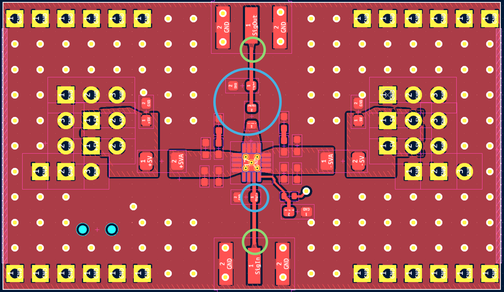

Thermal management features prominently in the layout, with large copper areas connected to the thermal pads of the power components to dissipate heat effectively. The placement of components followed a strict hierarchy, with critical RF components placed first to establish the signal path, followed by power components, and finally, passive components.

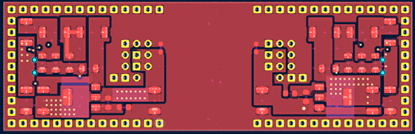
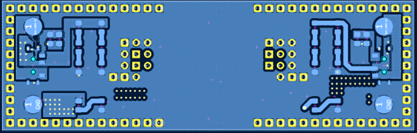

Above the outer layers are shown, the decision to go with a 4-layer PCB stemmed from the much-increased thermal mass as linear regulation is utilized, if the amplifier draws 250mW at 2.5V, that is 100mA of current draw. If a power supply of +/- 5V is assumed each rail will dissipate approximately 0.25W while at the max rated voltage of +/- 9V it would dissipate 1.3W. So, the additional layers along with solder mask pull-back help with heat dissipation. The thermal hotspots and high current tracks have been reinforced with vias to other layers for the same reason.

## Assembly and Testing
The assembly process demanded precision techniques, utilizing a custom aluminum stencil for consistent solder paste application. Lead-based solder paste was selected for its superior reflow characteristics and lower melting point. Component placement proved critical, particularly for the RF sections where positioning affects impedance matching.

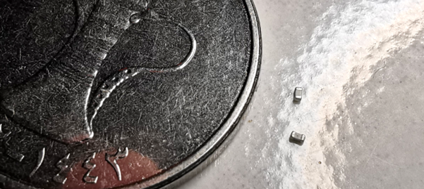
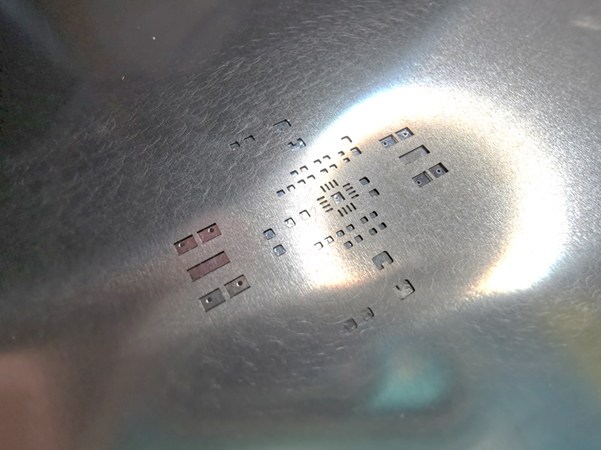

Testing began with careful characterization of the system noise floor and VNA calibration. S-parameter measurements revealed excellent performance: input matching better than -10dB, forward gain of 9.5dB, and minimal reverse isolation. Power consumption and thermal performance remained within design parameters throughout extended operation.

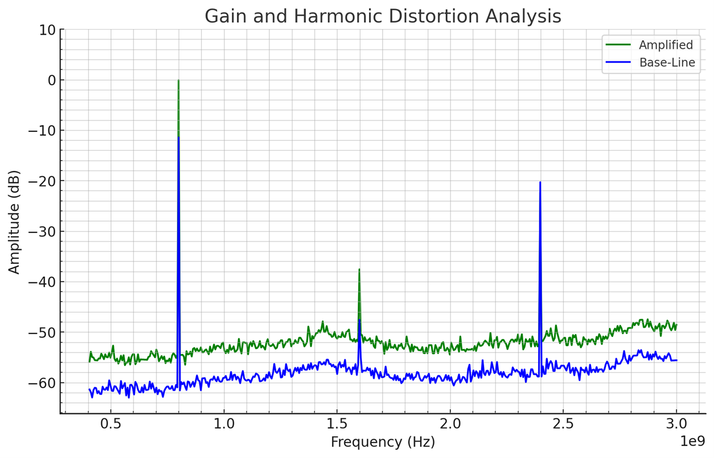

## Performance Validation
Real-world testing confirmed the theoretical predictions. The amplifier achieved a consistent 9.5dB gain across the target band, extending effective range from 10m to 31.62m. Spectral analysis showed clean output with minimal spurious emissions, while thermal imaging confirmed stable operation under load. The design proved particularly effective in LoRa WAN applications, where the extended range significantly improved network reliability.

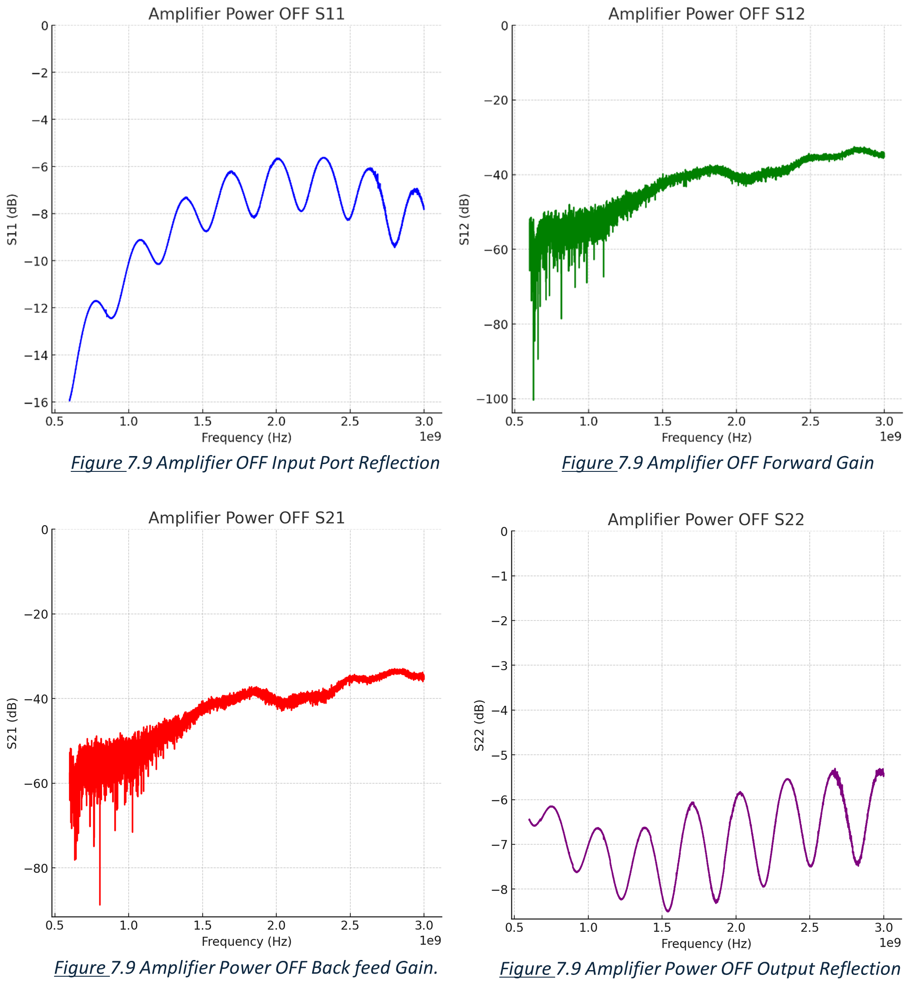
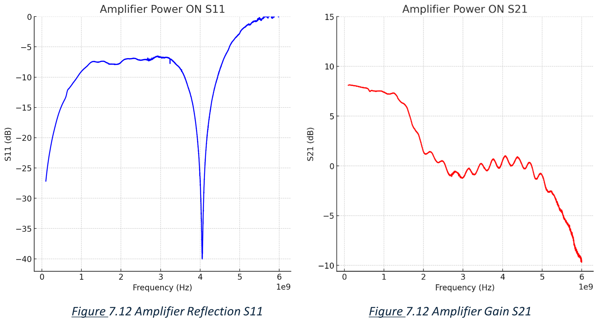

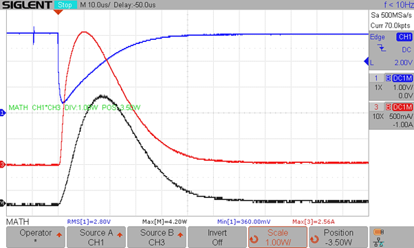

## Future Development
Ongoing development focuses on several key areas: power optimization to reduce current consumption, enhanced surge protection for robust field deployment, thermal optimization for extreme environments, and investigation of alternative package options for automated assembly. Each improvement aims to maintain or enhance the core performance while adding practical value for volume production.

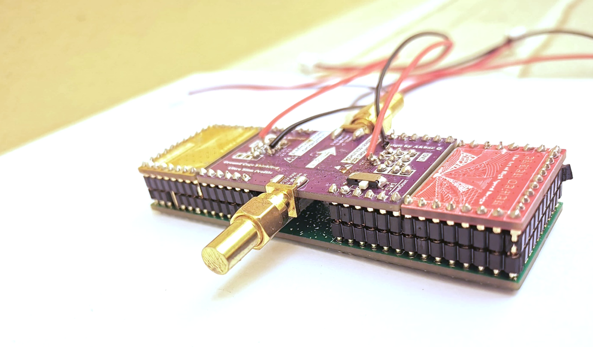

## Conclusion
This project successfully demonstrates the viability of compact RF amplification for IoT applications. The achieved performance metrics, combined with practical assembly considerations and robust thermal management, provide a solid foundation for reliable IoT deployments requiring extended range capability.

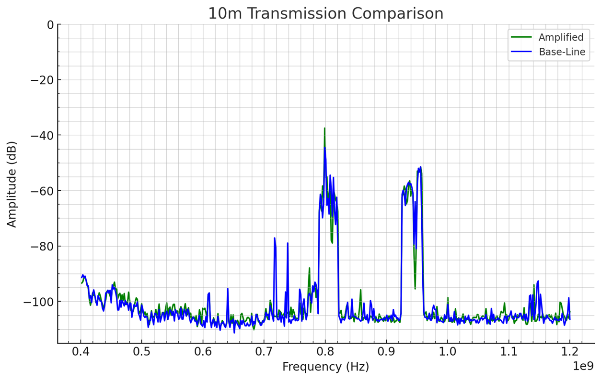